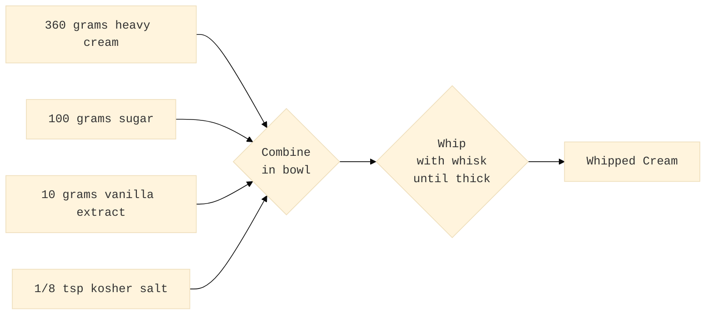
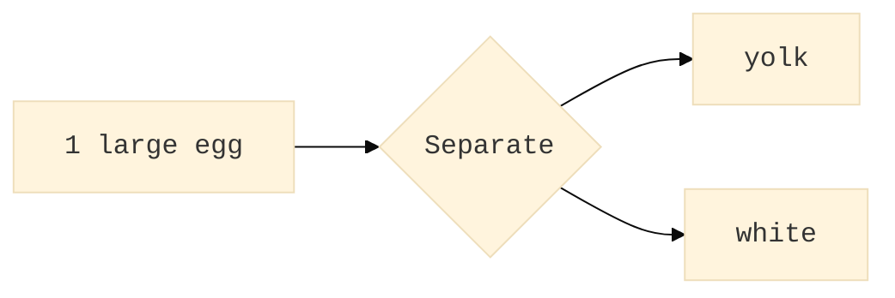
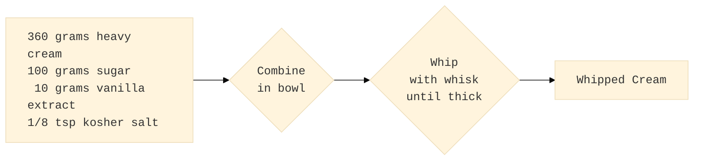
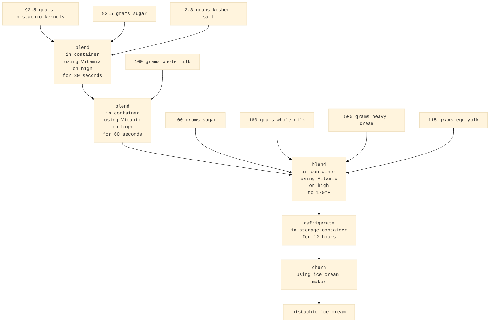

# Aquilo

A project for representing recipes as Directed Acyclic Graphs

# Introduction

A recipe describes how to start with a set of ingredients and apply a sequence of operations to arrive at a final product. A Directed Acyclic Graph (DAG) is a mathematical concept with nodes and directed edges that connect nodes. This project aims to create a specification of nodes and edges to enable concise representation of a recipe as a DAG.

For example, a recipe for whipped cream is represented by the DAG:



# Ingredients and Recipe Steps as Nodes with Properties

A DAG is an abstract concept defined in terms of graph nodes and directed edges. Defining additional structure on a DAG brings the abstract definition into the domain of food recipes. Three node kinds, each having a list of required and optional properties, enable representing both recipes and hints for formatting the recipe for visual display:
- Ingredient Nodes
- Operation Nodes
- Final Product Nodes

The following subsections describe each node kind and associated properties. A property is a key/value pair used to systematically encode important aspects of the node. For example, every node must have a **uuid** property key with a [RFC4122](https://datatracker.ietf.org/doc/html/rfc4122) Universally Unique IDentifier value and the node may have a **data** property key with a string value that encodes editor or display application specific information. The uuid is only used to identify the node in a single recipe, so the same ingredient in two different recipes will have different uuid values.

A node also has **ports** to indicate what flows in and out. An ingredient node will typically have a single **output** port. Operation nodes will have one or more initial **input** ports and usually one **output** port. For operations that require inputs during the operations, such as slowly streaming the ingredient in over time, will have a **during** port. The port name **uno** is used when a port list has a single entry.

An edge is a link between an **output** port and an **input** or **during** port.  Ports in an edge specification are named by `uuid.type.name` with the uuid of the **node**, one of `input`, `during`, or `output`,  and the port **name** forming one side of the edge.

In the following sections,
- a **bold** property key indicates it is required
- a normal text property key is optional
- a _italic_ property value indicates it is an example of the value and will likely be different in an actual recipe DAG
- a normal text property value is the specific value for the node kind

### Translatable Strings

The Aquilo framework is written in English, but the aim is to support displaying recipes in multiple languages. Display strings in node and edge specifications are written in English with a standard way to indicate translations to other languages. Translatable strings use a `language_REGION` key tag the string, where `language` is the [ISO 639-1](https://en.wikipedia.org/wiki/List_of_ISO_639-1_codes) (or [ISO 639-2](https://en.wikipedia.org/wiki/List_of_ISO_639-2_codes) if an 639-1 code does not exist) and `REGION` is the [ISO 3166-1](https://en.wikipedia.org/wiki/ISO_3166-1) code for the region.  For example, a recipe title is translatable, so the title is a mapping:

```yaml
title:
  en_US: Recipe Title
```

## Ingredients as Source Nodes

An ingredient node represents a single item and has the following properties
- **kind**: source
- **uuid**: _4B049226-5437-4724-B5F1-2336938850AE_
- **name**: {en_US: _heavy cream_}
- **unit**: _gram_
- **quantity**: _360_
- **output**: [_uno_]
- annotation: {en_US: _cold_}
- data: _null_

## Operations as Internal Nodes

Combine and Whip are two operations in the whipped cream example. Combine simple means to group the ingredients together into a common vessel, but Whip requires a tool and terminate condition. Terminate conditions describe when the operation is complete. Part of this specification is a registry of available operations, vessels, tools, intensity, and terminate conditions. The registry will grow over time to accommodate recipes that cannot be accurately represented using the available operations.

An operation node has the following properties
- **kind**: operation
- **uuid**: _32DB627B-F311-4FC7-998F-86F382E08F98_
- **name**: _whip_
- **input**: [_uno_]
- **during**: []
- **output**: [_uno_]
- **vessel**: _null_
- **tool*: _whisk_
- **intensity**: _null_
- **terminate**: _{until: thick}_
- annotation: {en_US: _vigorously_}
- data: _null_

The `name` field for an operation is not translatable because Aquilo defines all available operations and the definition of an operation provides the translation strings.

### Example Operation with Two Output Ports

Separating an egg yields the whites and yolk as outputs.  



- **kind**: operation
- **uuid**: _82C766EB-43C4-4E6E-8C22-5676387E0E12_
- **name**: _separate_
- **input**: [_uno_]
- **during**: []
- **output**: [_yolk_, _white_]
- **intensity**: _null_
- **terminate**: _null_

The ports `82C766EB-43C4-4E6E-8C22-5676387E0E12.output.yolk` and `82C766EB-43C4-4E6E-8C22-5676387E0E12.output.white` distinguish the two outputs from this example separation operation.

## Final Products as Sink Nodes

A node with no outgoing edges in a DAG is called a sink and in a recipe graph the final product is a sink. A sink node has the following properties
- **kind**: sink
- **uuid**: _F85C5E8B-690F-4E77-96FA-E4DDF4994509_
- **name**: {en_US: _Whipped Cream_}
- **input**: [_uno_]
- annotation: {en_US: _enjoy_}
- data: _null_

## Grouping Nodes for Streamlined Display

The Whipped Cream example has four ingredients and an application may choose to group all ingredients entering a single operation node into a single display box.



# Directed Edges

A directed edge is an arrow from an **output** port to an **input** or **during** port of a different node with properties
- **kind**: edge
- **uuid**: _40A45365-CA92-4E0B-A865-35A89F0D9FB2_
- **source**: _F3274656-E756-46DC-B083-814225BBBE40.output.uno_
- **destination**: _2305DE0D-7255-4EAB-AD29-D5FC11F236C1.input.uno_
- annotation: _null_
- data: _null_

# Registry of Operation Nodes Properties

One aspect of the project **Aquilo** is to gather a concise list of operation nodes that enable the representation of a wide range of recipes. During the initial development of Aquilo, the registry of operations and properties will likely change often as more people and recipes attempt to use Aquilo.

## Registry
- [Intensities](schemas/intensities.yaml) registry is the list of valid intensity modifiers for an operations, such high, medium, low, or 350°F. If the registry grows too large, the individual entries will be separated into individual files. 
- [Operations](schemas/operations.yaml) registry is the list of valid operations. Each operation is described in an individual schema file in the subdirectory [operations](schemas/operations).
- [Source Unit](schemas/source-unit.yaml) registry is the list of supported units for specifying source nodes.
- [Terminate Conditions](schemas/terminate-conditions.yaml) registry is the list of valid terminate conditions used to indicate when an operation is complete. Each termination condition is described in an individual schema file in the subdirectory [terminate-conditions](schemas/terminate-conditions).
- [Tools](schemas/tools.yaml) registry is the list of valid kitchen tools for carrying out operations. Each tool is described in an individual schema file in the subdirectory [tools](schemas/tools).
- [Vessels](schemas/vessels.yaml) registry is the list of valid vessels to hold ingredients and intermediate mixtures. Each vessel is described in an individual schema file in the subdirectory [vessels](schemas/vessels).

### Other Schema Files

- [Localize](schemas/localize.yaml) specifies a translatable string must have an `en_US` entry and allows for translation strings.
- [Recipe](schemas/recipe/recipe.yaml) specifies the overall format for an Aquilo recipe.
- [UUID](schemas/uuid.yaml) specifies the format for `uuid` values.

# YAML as a Common Exchange format for Recipe DAGs

YAML is a convenient format to encode the collection of nodes and edges for a recipe with additional information, such as source, author, and date. An Aquilo Recipe DAG can be encode as a YAML document. The schema [recipe.yaml](schemas/recipe/reciple.yaml) defines a valid recipe.

# A Complete Example

See [Pistachio Ice Cream](examples/pistachio.yaml) for a complete example of a Aquilo Recipe DAG. The following diagram is a basic representation of the Pistachio Ice Cream DAG example.



# Validating a Recipe

AJV is a JSON schema validator available via node that also works with YAML schema and YAML documents. To validate a recipe against the Aquilo Recipe DAG schema, run

```bash
ajv --spec=draft2020 validate \
  -r './schemas/*.yaml' \
  -r './schemas/[^r]*/*.yaml' \
  -s ./schemas/recipe/recipe.yaml \
  -d examples/pistachio.yaml
```

# From Aquilo Recipe YAML to Display

Processing an Aquilo recipe to produce a pleasing presentation requires determining the position of each node, the geometry of directed edges including the coordinates where the edge leaves one node and enters another node, and most importantly the textual representation of each node. **Source** and **Sink** nodes are relatively simple, but **Operation** nodes are complex with several optional values. Translatable strings must also be processed.

## _TODO_

- Work through the algorithm for converting an operation node to a display node 
  - what are the "glue" words to assembly the various attributes?
  - how does translation work?
- Modify and then validate existing operation schemas (and terminate, vessel, etc) are compatible with the above algorithm
- Create a few additional examples and create the needed schema files and registry entries
- Prototype javascript code to carryout node layout
  - source - source-units & translations
  - sink - translations
  - operation - above algorithm
  - grouping source nodes
- Prototype node editor
- Prototype adding edges
- Prototype graph layout

