# Aquilo

A project for representing recipes as Directed Acyclic Graphs

# Introduction

A recipe describes how to start with a set of ingredients and apply a sequence of operations to arrive at a final product. A Directed Acyclic Graph (DAG) is a mathematical concept with nodes and directed edges that connect nodes. This project aims to create a specification of nodes and edges to enable concise representation of a recipe as a DAG.

For example, a recipe for whipped cream is represented by the DAG:

```mermaid
%%{
  init: {
    'theme': 'base',
    'themeVariables': {
      'fontFamily': 'monospace'
    }
  }
}%%
flowchart LR
  I["360 grams heavy cream
100 grams sugar
 10 grams vanilla extract
1/8 tsp kosher salt"]
  C{Combine}
  W{"Whip
<b>until</b>
thick"}
  T[Whipped Cream]
  I --> C;
  C --> W;
  W --> T;
  style I text-align:left
```

  
# Ingredients and Recipe Steps as Nodes with Properties

A DAG is an abstract concept defined in terms of graph nodes and directed edges. Defining additional structure on a DAG brings the abstract definition into the domain of food recipes. Four node types, each having a list of required and optional properities, enable representing both recipes and hints for formating the recipe for visual display:
- Ingredient Nodes
- Operation Nodes
- Final Proudct Nodes
- Grouping Nodes

The following subsections describe each node type and associated properties. A property is a key/value pair used to systematically encode important aspects of the node. For example, every node must have a **uuid** property key with a [RFC4122](https://datatracker.ietf.org/doc/html/rfc4122) Universally Unique IDentifier value and the node may have a **css** property key with a string value encoding a Cascading Style Sheet declarations for formating the node. The uuid is only used to identify the node in a single recipe, so the same ingredient in two different recipes will have different uuid values.

A node also has **ports** to indicate what flows in and out. An ingredient node will typically have a single **output** port and no **input** port. Operation nodes will have one or more **input** ports and usually one **output** port. The port name **uno** is used when a port list has a single entry

In the following sections,
- a **bold** property key indicates it is required
- a normal text property key is optional
- a _italic_ property value indicates it is an example of the value and will likely be different in an actual recipe DAG
- a normal text property value is the specific value for the node type

## Ingredients as Source Nodes

There are four ingredients in the whipped cream example in the introduction. The ingredients are presented as a single **group** node to improve readability. An ingredient node represents a single item and has the following properties
- **type**: source
- **uuid**: _4B049226-5437-4724-B5F1-2336938850AE_
- **name**: _heavy cream_
- **unit**: _gram_
- **quantity**: _360_
- **output**: [uno]
- description: _cold_
- upc: _742365-216855_
- ean: _0-742365-216855_
- e-number: _E100_

## Operations as Internal Nodes

## Final Products as Sink Nodes

## Grouping Nodes for Streamlined Display

# YAML as a Common Exchange format for Recipe DAGs
