# Aquilo

A project for representing recipes as Directed Acyclic Graphs

# Introduction

A recipe describes how to start with a set of ingredients and apply a sequence of operations to arrive at a final product. A Directed Acyclic Graph (DAG) is a mathematical concept with nodes and directed edges that connect nodes. This project aims to create a specification of nodes and edges to enable concise representation of a recipe as a DAG.

For example, a recipe for whipped cream is represented by the DAG:

```mermaid
%%{
  init: {
    'theme': 'base',
    'themeVariables': {
      'fontFamily': 'monospace'
    }
  }
}%%
flowchart LR
  I["360 grams heavy cream
100 grams sugar
 10 grams vanilla extract
1/8 tsp kosher salt"]
  C{Combine}
  W{"Whip
<b>until</b>
thick"}
  T[Whipped Cream]
  I --> C;
  C --> W;
  W --> T;
  style I text-align:left
```

  
# Ingredients and Recipe Steps as Nodes with Properties

A DAG is an abstract concept defined in terms of graph nodes and directed edges. Defining additional structure on a DAG brings the abstract definition into the domain of food recipes. Four node types, each having a list of required and optional properities, enable representing both recipes and hints for formating the recipe for visual display:
- Ingredient Nodes
- Operation Nodes
- Final Proudct Nodes
- Grouping Nodes

The following subsections describe each node type and associated properties. A property is a key/value pair used to systematically encode important aspects of the node. Every node has one required properity and one optional properity:
- Required
  - **uuid** - A (RFC4122)[https://datatracker.ietf.org/doc/html/rfc4122] Universally Unique IDentifier
- Optional
  - **css** - Cascading Style Sheet declarations for formating the node

## Ingredients as Source Nodes

## Operations as Internal Nodes

## Final Products as Sink Nodes

## Grouping Nodes for Streamlined Display

# YAML as a Common Exchange format for Recipe DAGs
